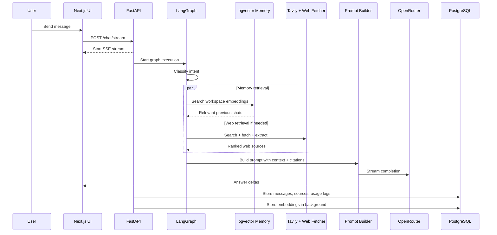

# Multi-Workspace AI Chat Application — Final Architecture Plan

## 0. Version Notes

This version includes the final decisions and refinements discussed:

- Supabase Auth for authentication
- Tavily Search API for URL discovery and LLM-ready search snippets
- Custom web retrieval pipeline, not built-in SDK browsing
- PostgreSQL + pgvector for persistent storage and semantic retrieval
- 768-dimensional remote embeddings using an OpenAI-compatible embeddings API
- LangGraph-based controlled agent orchestration
- SSE streaming with reasoning/status updates and final answer deltas
- Context compression and prompt budgeting
- Chat summarization layer
- Celery + Redis background processing plan for document ingestion and embeddings
- Security, observability, failure handling, and scaling strategy

---

## 1. Project Context

This project is a multi-workspace AI chat application for an AI intern screening assignment. The application must support:

- Multiple named and visually distinguishable workspaces
- Isolated chat sessions inside each workspace
- Persistent chat history and sidebar browsing
- Real-time streaming responses
- Visible reasoning/status updates before and during answer generation
- Live web-connected responses without built-in SDK browsing plugins
- Cross-chat contextual retrieval using semantic embeddings
- Cross-chat citations when previous chats are used
- OpenRouter usage with strict API cost management
- Public GitHub repository, hosted demo, and written documentation

The architecture is optimized around the highest-priority evaluation areas:

| Evaluation Area | Weight | Architecture Response |
|---|---:|---|
| Cross-chat contextual retrieval | 30% | Workspace-scoped pgvector memory retrieval with citations |
| Streaming reasoning implementation | 20% | SSE status/reasoning stream + final answer stream |
| Real-time web connectivity | 20% | Tavily Search + custom rank/rerank/compress/cite pipeline |
| Code quality and architecture | 15% | Monorepo, layered services, LangGraph orchestration |
| UI/UX polish | 10% | Next.js + Shadcn workspace dashboard and streaming chat UI |
| Documentation and rationale | 5% | Architecture, retrieval, streaming, auth, and cost docs |

---

## 2. Final High-Level Architecture

```text
Next.js + Shadcn UI
        ↓
FastAPI Backend
        ↓
SSE Streaming Layer starts immediately
        ↓
LangGraph Agent Orchestrator
        ↓
Intent Router
   ├── Direct Answer
   ├── Workspace Memory Retrieval
   ├── Live Web Retrieval
   └── Memory + Web Retrieval
        ↓
Retrieval Layer
   ├── Workspace semantic memory via PostgreSQL + pgvector
   └── Live web search via Tavily Search + custom rank/rerank/citation pipeline
        ↓
Reranker
        ↓
Context Compressor
        ↓
Prompt Builder
        ↓
OpenRouter LLM Gateway
        ↓
Citation Builder
        ↓
SSE Streaming
   ├── reasoning/status stream
   └── final answer stream
        ↓
PostgreSQL + pgvector persistent storage
        ↓
Redis caching + rate limits
        ↓
Observability: logs, usage, tool calls, latency, failures
```

---

## 3. End-to-End Request Flow

```text
User
 ↓
Next.js UI
 ↓
FastAPI /chat/stream
 ↓
SSE Stream Starts Immediately
 ↓
LangGraph Agent Orchestrator
 ↓
Intent Router
 ↓
┌──────────────────────────┐
│ Workspace Memory Search  │
└──────────────────────────┘
 ↓
┌──────────────────────────┐
│ Tavily Web Retrieval     │
└──────────────────────────┘
 ↓
Reranker
 ↓
Context Compressor
 ↓
Prompt Builder
 ↓
OpenRouter LLM Gateway
 ↓
Citation Builder
 ↓
Stream Final Answer
 ↓
Store User + Assistant Messages
 ↓
Background Embedding Job
 ↓
PostgreSQL + pgvector
```

Mermaid version:



---

## 4. Requirement Coverage

| Requirement | Covered? | Implementation |
|---|---|---|
| Multi-workspace architecture | Yes | `workspaces`, `chat_sessions`, `messages` with workspace isolation |
| Workspace visual distinction | Yes | Workspace name, color, icon in UI |
| Real-time web responses | Yes | Tavily Search + custom retrieval pipeline |
| No built-in SDK browsing plugin | Yes | Backend performs fetch, extraction, ranking, citations manually |
| Agentic framework | Yes | LangGraph |
| Streaming token-by-token | Yes | SSE answer delta events |
| Visible reasoning/status | Yes | Safe status and reasoning-summary events |
| Persistent chat logs | Yes | PostgreSQL messages and chat sessions |
| Sidebar chat browsing | Yes | Chat session list by workspace |
| Cross-chat contextual awareness | Yes | pgvector retrieval filtered by workspace |
| Semantic retrieval, not hardcoded | Yes | 768-dimensional embeddings |
| Cross-chat citations | Yes | Retrieved chunks include chat/message metadata |
| OpenRouter usage | Yes | OpenAI SDK with OpenRouter base URL |
| Cost strategy | Yes | Model routing, batched remote embeddings, Redis cache, usage logs |
| Hosted product | Yes | Vercel + Render + Supabase + Upstash |

---

## 5. Why Each Technology Is Used

### 5.1 Next.js

Next.js is used for the frontend because it provides:

- Fast product development
- File-based routing
- Strong TypeScript support
- Smooth Vercel deployment
- Good support for streaming UI updates
- Easy integration with Supabase Auth
- Clean dashboard-style workspace layouts

Frontend responsibilities:

- Workspace dashboard
- Workspace switcher
- Chat session sidebar
- Message interface
- Streaming status/reasoning panel
- Final answer renderer
- Citation/source panel
- Settings and usage visibility

---

### 5.2 Shadcn UI

Shadcn UI is used for rapid, polished UI development.

It helps with:

- Sidebar
- Dialogs
- Cards
- Buttons
- Dropdowns
- Tabs
- Toasts
- Workspace color coding
- Consistent component styling

This directly supports the requirement that workspaces must be visually distinguishable.

---

### 5.3 FastAPI

FastAPI is used to build the backend REST and streaming APIs.

FastAPI is not an alternative to REST APIs; it is the framework used to implement REST-style and streaming endpoints.

Why FastAPI:

- Python-first AI ecosystem
- Easy LangGraph integration
- Clean async support
- Server-Sent Events support
- OpenAPI/Swagger docs generated automatically
- Good fit for retrieval, embeddings, web fetching, and LLM orchestration

Backend responsibilities:

- Supabase JWT verification
- Workspace CRUD
- Chat session CRUD
- Message persistence
- SSE streaming
- LangGraph execution
- Tool execution
- Usage logging
- Tavily Search retrieval
- Semantic memory retrieval

---

### 5.4 Supabase Auth

Supabase Auth is used for authentication.

Why Supabase Auth:

- Fast reliable setup
- Works naturally with Supabase PostgreSQL
- Reduces custom auth complexity
- Good for hosted assignment demo
- Supports user-specific workspace isolation

Every backend request must verify:

```text
authenticated user owns workspace_id
workspace_id owns chat_id
message belongs to workspace_id
```

---

### 5.5 PostgreSQL

PostgreSQL is the main persistent database.

It stores:

- Users
- Workspaces
- Chat sessions
- Messages
- Web sources
- Tool calls
- Usage logs
- Document metadata if added later

Why PostgreSQL:

- Reliable relational storage
- Strong indexing
- Easy joins
- Works with pgvector
- Good hosted support through Supabase

---

### 5.6 pgvector

pgvector is used for semantic memory retrieval.

Why pgvector:

- Avoids a separate vector database for assignment scale
- Works directly inside PostgreSQL
- Supports HNSW indexing
- Simplifies deployment
- Good enough for workspace-specific chat retrieval

It stores embeddings for:

- User messages
- Assistant responses
- Chat summaries
- Future document chunks

---

### 5.7 Redis

Redis is used for caching and rate-limiting.

Redis responsibilities:

- Rate limiting
- Request deduplication
- Web search result caching
- Page extraction result caching
- Temporary stream/session state
- Cost-limit counters
- Optional background task status

Recommended hosted option:

```text
Upstash Redis
```

Why Redis:

- Very fast
- Simple to use
- Helps reduce OpenRouter and Tavily usage
- Improves latency
- Protects against accidental cost spikes

---

### 5.8 LangGraph

LangGraph is used as the agent orchestration layer.

Why LangGraph instead of plain LangChain:

- Graph-based control flow
- Branching
- Tool routing
- Multi-step workflows
- Explicit state management
- Better debugging than uncontrolled agent loops
- Suitable for combining memory retrieval, web retrieval, prompt building, and answer generation

Preferred design:

```text
Classifier / intent router
        ↓
Run required tools once
        ↓
Build prompt
        ↓
One final LLM call
```

Avoid:

```text
LLM → tool → LLM → tool → LLM → tool → final
```

because it increases cost, latency, and unpredictability.

---

### 5.9 OpenRouter

OpenRouter is used as the LLM gateway because the assignment provides an OpenRouter API key and asks for OpenAI SDK compatibility.

Recommended client design:

```python
from openai import OpenAI
import os

client = OpenAI(
    api_key=os.getenv("LLM_API_KEY"),
    base_url=os.getenv("LLM_BASE_URL")
)
```

Development environment:

```env
LLM_API_KEY=your_openai_key
LLM_BASE_URL=https://api.openai.com/v1
DEFAULT_MODEL=gpt-4o-mini
```

Production/demo environment:

```env
LLM_API_KEY=your_openrouter_key
LLM_BASE_URL=https://openrouter.ai/api/v1
DEFAULT_MODEL=openai/gpt-4o-mini
```

This allows development with a personal OpenAI key while deploying with OpenRouter.

---

### 5.10 Tavily Search API

Tavily Search is used for URL discovery and clean search snippets in the custom web retrieval pipeline.

Important distinction:

The project does not use built-in LLM browsing plugins.

Tavily is used to discover candidate URLs and provide LLM-friendly source snippets. The backend still owns retrieval decisions:

```text
Tavily Search API
        ↓
Candidate URLs and snippets
        ↓
Backend optionally fetches pages manually
        ↓
Backend extracts readable text
        ↓
Backend ranks snippets
        ↓
Backend builds citations
        ↓
LLM receives structured source context
```

This qualifies as a custom web retrieval implementation because the application is responsible for fetching, extraction, ranking, citation formatting, and prompt injection.

---

## 6. Model Selection Matrix

The architecture separates model responsibilities to optimize latency and cost.

| Responsibility | Model | Reason |
|---|---|---|
| Query classification | Gemini Flash Lite or similar cheap OpenRouter model | Fast and inexpensive |
| Intent routing | Gemini Flash Lite or similar cheap OpenRouter model | Low latency |
| Chat title generation | Gemini Flash Lite or similar cheap OpenRouter model | Small output requirement |
| Final answer generation | GPT-4o Mini through OpenRouter | Strong quality-to-cost ratio |
| Backup generation model | Claude Haiku or another low-cost reliable model | Fallback reliability |
| Embeddings | `text-embedding-3-small` or `openai/text-embedding-3-small` | Remote 768-dimensional embeddings that match pgvector schema without loading local model weights |
| Future reranking | Lightweight deterministic reranker by default; optional cross-encoder only on larger workers | Avoids memory spikes on Render starter-sized workers |

This architecture prioritizes deployment stability over fully local embeddings. Remote batched embeddings add a small provider cost, but they avoid loading a sentence-transformer/PyTorch stack into the API or Celery worker.

---

## 7. Monorepo Decision

Use a monorepo.

Why monorepo:

- Simpler for assignment submission
- One public GitHub repo
- Easier setup instructions
- Shared types between frontend and backend
- Easier documentation
- Lower deployment complexity than microservices

Avoid microservices for this assignment because they add unnecessary complexity, multiple deployment surfaces, and debugging overhead.

Recommended structure:

```text
ai-workspace-chat/
│
├── apps/
│   ├── web/
│   │   ├── app/
│   │   ├── components/
│   │   ├── hooks/
│   │   ├── lib/
│   │   ├── styles/
│   │   └── package.json
│   │
│   └── api/
│       ├── app/
│       │   ├── main.py
│       │   ├── routes/
│       │   │   ├── auth.py
│       │   │   ├── workspaces.py
│       │   │   ├── chats.py
│       │   │   └── stream.py
│       │   ├── agents/
│       │   │   ├── graph.py
│       │   │   ├── nodes.py
│       │   │   └── state.py
│       │   ├── tools/
│       │   │   ├── memory_retriever.py
│       │   │   ├── web_search.py
│       │   │   ├── webpage_reader.py
│       │   │   ├── citation_builder.py
│       │   │   └── usage_tracker.py
│       │   ├── services/
│       │   │   ├── prompt_builder.py
│       │   │   ├── context_compressor.py
│       │   │   ├── embedding_service.py
│       │   │   ├── reranker.py
│       │   │   ├── streaming_service.py
│       │   │   ├── summarizer_service.py
│       │   │   ├── workspace_service.py
│       │   │   ├── chat_service.py
│       │   │   └── document_service.py
│       │   ├── jobs/
│       │   │   ├── embed_message.py
│       │   │   ├── summarize_chat.py
│       │   │   └── cleanup_cache.py
│       │   ├── db/
│       │   │   ├── connection.py
│       │   │   ├── models.py
│       │   │   └── migrations/
│       │   ├── schemas/
│       │   └── config.py
│       ├── requirements.txt
│       └── Dockerfile
│
├── packages/
│   └── shared/
│       └── types/
│
├── docs/
│   ├── architecture.md
│   ├── api-cost-strategy.md
│   ├── streaming.md
│   ├── cross-chat-retrieval.md
│   ├── web-retrieval.md
│   ├── authentication.md
│   ├── security.md
│   └── deployment.md
│
├── docker-compose.yml
├── README.md
├── .env.example
├── .gitignore
└── package.json
```

---

## 8. Database Schema

### 8.1 users

```sql
CREATE TABLE users (
    id UUID PRIMARY KEY DEFAULT gen_random_uuid(),
    supabase_user_id UUID UNIQUE NOT NULL,
    name TEXT,
    email TEXT UNIQUE NOT NULL,
    created_at TIMESTAMPTZ DEFAULT now()
);

CREATE INDEX idx_users_supabase_user_id ON users(supabase_user_id);
CREATE INDEX idx_users_email ON users(email);
```

---

### 8.2 workspaces

```sql
CREATE TABLE workspaces (
    id UUID PRIMARY KEY DEFAULT gen_random_uuid(),
    user_id UUID NOT NULL REFERENCES users(id) ON DELETE CASCADE,
    name TEXT NOT NULL,
    color TEXT,
    icon TEXT,
    created_at TIMESTAMPTZ DEFAULT now(),
    updated_at TIMESTAMPTZ DEFAULT now()
);

CREATE INDEX idx_workspaces_user_id ON workspaces(user_id);
CREATE INDEX idx_workspaces_user_created ON workspaces(user_id, created_at DESC);
```

---

### 8.3 chat_sessions

```sql
CREATE TABLE chat_sessions (
    id UUID PRIMARY KEY DEFAULT gen_random_uuid(),
    workspace_id UUID NOT NULL REFERENCES workspaces(id) ON DELETE CASCADE,
    title TEXT,
    summary TEXT,
    last_summarized_at TIMESTAMPTZ,
    created_at TIMESTAMPTZ DEFAULT now(),
    updated_at TIMESTAMPTZ DEFAULT now()
);

CREATE INDEX idx_chat_sessions_workspace ON chat_sessions(workspace_id);
CREATE INDEX idx_chat_sessions_workspace_updated
ON chat_sessions(workspace_id, updated_at DESC);
```

---

### 8.4 messages

```sql
CREATE TABLE messages (
    id UUID PRIMARY KEY DEFAULT gen_random_uuid(),
    workspace_id UUID NOT NULL REFERENCES workspaces(id) ON DELETE CASCADE,
    chat_id UUID NOT NULL REFERENCES chat_sessions(id) ON DELETE CASCADE,
    role TEXT NOT NULL CHECK (role IN ('user', 'assistant', 'system', 'tool')),
    content TEXT NOT NULL,
    reasoning_summary TEXT,
    created_at TIMESTAMPTZ DEFAULT now()
);

CREATE INDEX idx_messages_chat_time
ON messages(chat_id, created_at ASC);

CREATE INDEX idx_messages_workspace_time
ON messages(workspace_id, created_at DESC);

CREATE INDEX idx_messages_workspace_role_time
ON messages(workspace_id, role, created_at DESC);
```

---

### 8.5 message_embeddings

The production embedding model is:

```text
text-embedding-3-small
```

Dimension:

```text
768
```

When routed through OpenRouter, use:

```text
openai/text-embedding-3-small
```

The application uses an OpenAI-compatible remote embeddings client. `EMBEDDING_PROVIDER=openai` means "OpenAI-compatible API", so it can point either to direct OpenAI or to OpenRouter by changing `EMBEDDING_BASE_URL`.

Schema:

```sql
CREATE EXTENSION IF NOT EXISTS vector;

CREATE TABLE message_embeddings (
    id UUID PRIMARY KEY DEFAULT gen_random_uuid(),
    message_id UUID REFERENCES messages(id) ON DELETE CASCADE,
    workspace_id UUID NOT NULL REFERENCES workspaces(id) ON DELETE CASCADE,
    chat_id UUID REFERENCES chat_sessions(id) ON DELETE CASCADE,
    source_type TEXT NOT NULL CHECK (source_type IN ('chat', 'document', 'summary')),
    content_chunk TEXT NOT NULL,
    embedding vector(768),
    created_at TIMESTAMPTZ DEFAULT now()
);

CREATE INDEX idx_embeddings_workspace
ON message_embeddings(workspace_id);

CREATE INDEX idx_embeddings_chat
ON message_embeddings(chat_id);

CREATE INDEX idx_embeddings_workspace_time
ON message_embeddings(workspace_id, created_at DESC);

CREATE INDEX idx_embeddings_vector_hnsw
ON message_embeddings
USING hnsw (embedding vector_cosine_ops);
```

Retrieval must always filter by `workspace_id`.

Example query:

```sql
SELECT
    me.content_chunk,
    me.chat_id,
    me.message_id,
    m.role,
    m.created_at,
    1 - (me.embedding <=> $1) AS similarity
FROM message_embeddings me
LEFT JOIN messages m ON m.id = me.message_id
WHERE me.workspace_id = $2
ORDER BY me.embedding <=> $1
LIMIT 20;
```

The application retrieves top 20 candidates, reranks them, and injects the top 5.

---

### 8.6 web_sources

```sql
CREATE TABLE web_sources (
    id UUID PRIMARY KEY DEFAULT gen_random_uuid(),
    workspace_id UUID REFERENCES workspaces(id) ON DELETE CASCADE,
    chat_id UUID REFERENCES chat_sessions(id) ON DELETE CASCADE,
    message_id UUID REFERENCES messages(id) ON DELETE CASCADE,
    url TEXT NOT NULL,
    title TEXT,
    snippet TEXT,
    extracted_text TEXT,
    retrieved_at TIMESTAMPTZ DEFAULT now()
);

CREATE INDEX idx_web_sources_chat
ON web_sources(chat_id, retrieved_at DESC);

CREATE INDEX idx_web_sources_message
ON web_sources(message_id);

CREATE INDEX idx_web_sources_url
ON web_sources(url);
```

---

### 8.7 tool_calls

```sql
CREATE TABLE tool_calls (
    id UUID PRIMARY KEY DEFAULT gen_random_uuid(),
    workspace_id UUID NOT NULL REFERENCES workspaces(id) ON DELETE CASCADE,
    chat_id UUID NOT NULL REFERENCES chat_sessions(id) ON DELETE CASCADE,
    message_id UUID REFERENCES messages(id) ON DELETE SET NULL,
    tool_name TEXT NOT NULL,
    input JSONB,
    output JSONB,
    status TEXT CHECK (status IN ('pending', 'success', 'failed')),
    latency_ms INT,
    created_at TIMESTAMPTZ DEFAULT now()
);

CREATE INDEX idx_tool_calls_chat_time
ON tool_calls(chat_id, created_at DESC);

CREATE INDEX idx_tool_calls_workspace_tool
ON tool_calls(workspace_id, tool_name, created_at DESC);

CREATE INDEX idx_tool_calls_input_gin
ON tool_calls USING gin(input);

CREATE INDEX idx_tool_calls_output_gin
ON tool_calls USING gin(output);
```

---

### 8.8 usage_logs

```sql
CREATE TABLE usage_logs (
    id UUID PRIMARY KEY DEFAULT gen_random_uuid(),
    user_id UUID REFERENCES users(id) ON DELETE CASCADE,
    workspace_id UUID REFERENCES workspaces(id) ON DELETE CASCADE,
    chat_id UUID REFERENCES chat_sessions(id) ON DELETE CASCADE,
    model TEXT NOT NULL,
    prompt_tokens INT DEFAULT 0,
    completion_tokens INT DEFAULT 0,
    total_tokens INT DEFAULT 0,
    estimated_cost_usd NUMERIC(10, 6) DEFAULT 0,
    created_at TIMESTAMPTZ DEFAULT now()
);

CREATE INDEX idx_usage_user_time
ON usage_logs(user_id, created_at DESC);

CREATE INDEX idx_usage_workspace_time
ON usage_logs(workspace_id, created_at DESC);

CREATE INDEX idx_usage_model_time
ON usage_logs(model, created_at DESC);
```

---

### 8.9 documents

Document upload is not required for the assignment, but the architecture supports it later.

```sql
CREATE TABLE documents (
    id UUID PRIMARY KEY DEFAULT gen_random_uuid(),
    workspace_id UUID NOT NULL REFERENCES workspaces(id) ON DELETE CASCADE,
    uploaded_by UUID NOT NULL REFERENCES users(id) ON DELETE CASCADE,
    filename TEXT NOT NULL,
    file_type TEXT,
    storage_url TEXT,
    status TEXT CHECK (status IN ('uploaded', 'processing', 'ready', 'failed')),
    created_at TIMESTAMPTZ DEFAULT now()
);

CREATE INDEX idx_documents_workspace_time
ON documents(workspace_id, created_at DESC);
```

Document chunks can reuse `message_embeddings` with:

```text
source_type = 'document'
```

---

## 9. Embedding Strategy

### Chosen Model

```text
text-embedding-3-small
```

OpenRouter model slug:

```text
openai/text-embedding-3-small
```

### Dimension

```text
768
```

### Why 768 Dimensions

384-dimensional embeddings are fast and cheap, but can become limiting if the product later supports document upload, larger workspaces, or more complex semantic retrieval.

1536-dimensional embeddings improve quality but add:

- Higher storage
- Larger vector indexes
- More memory usage
- Slower retrieval
- More infrastructure overhead

768 dimensions are a strong middle ground:

- Better semantic quality than 384
- Lower latency and storage than 1536
- Good support for chat memory and future document upload
- Practical for pgvector + HNSW
- Remote embedding avoids Render worker memory spikes from local model weights

### Storage Comparison

Approximate raw vector size:

| Dimension | Bytes per vector | Relative size |
|---|---:|---:|
| 384 | 1.5 KB | 1x |
| 768 | 3 KB | 2x |
| 1536 | 6 KB | 4x |

The project chooses 768 because quality gains over 384 are useful, while the cost is still reasonable.

---

## 10. Chunking Strategy

Chunking quality matters as much as embedding model choice.

### Chat Messages

For regular chat memory:

```text
1 message = 1 chunk
```

For long assistant responses:

```text
chunk size = 500–800 tokens
overlap = 100 tokens
```

### Chat Summaries

Each completed or long chat gets a summary embedding:

```text
source_type = 'summary'
```

### Future Documents

For uploaded documents:

```text
chunk size = 500–800 tokens
overlap = 100 tokens
minimum chunk size = 150 tokens
```

Chunk metadata should include:

- workspace_id
- document_id
- page number if available
- section heading if available
- chunk index

---

## 11. Cross-Chat Retrieval Strategy

This is the most important project feature.

### Ingestion

After each user or assistant message:

```text
1. Save message in messages table
2. Chunk if needed
3. Generate 768-dimensional embedding
4. Store embedding in message_embeddings
5. Attach workspace_id and chat_id
```

### Retrieval

When a new query arrives:

```text
1. Generate query embedding
2. Search message_embeddings using pgvector
3. Filter strictly by workspace_id
4. Retrieve top 20 candidates
5. Rerank candidates
6. Compress context
7. Keep top 5 chunks
8. Inject relevant chunks into prompt
9. Cite previous chats in final answer
```

### Similarity Threshold

Recommended:

```text
Top K before rerank: 20
Top K after rerank: 5
Similarity threshold: 0.70–0.75
```

Only cite previous chats when relevance is strong.

### Citation Format

Example:

```text
Based on your earlier chat "Python Debugging Session", you were facing a similar import error...
```

Citation metadata should include:

- chat_id
- chat title
- message_id
- timestamp
- similarity score

---

## 12. Chat Summarization Layer

As workspace size grows, retrieving only individual messages becomes less efficient.

The system periodically generates semantic summaries of completed chats.

Workflow:

```text
Completed or long chat
        ↓
Background Summarizer
        ↓
Chat Summary
        ↓
Summary Embedding
        ↓
Stored in message_embeddings as source_type='summary'
```

Benefits:

- Better retrieval quality
- Lower prompt costs
- Faster context reconstruction
- Improved long-term memory
- Better handling of long conversations

MVP summarization trigger:

```text
Summarize after every 20 messages in a chat
or
Summarize when chat becomes inactive
```

---

## 13. Web Retrieval Strategy Using Tavily Search

The requirement says real-time web connectivity is required and inbuilt SDK browsing plugins must not be used.

### What We Avoid

Do not use:

- OpenAI built-in web browsing
- ChatGPT browsing plugin
- SDK-level browsing tools
- Perplexity-style answer APIs that browse and answer for us

### What We Use

Use Tavily for URL discovery and search snippets.

Custom pipeline:

```text
User query
        ↓
Intent router decides web is needed
        ↓
Tavily Search retrieves candidate URLs and snippets
        ↓
Backend fetches pages using httpx
        ↓
Backend extracts readable text using BeautifulSoup/trafilatura
        ↓
Backend removes boilerplate
        ↓
Backend chunks content
        ↓
Backend ranks sources
        ↓
Prompt Builder injects selected source snippets
        ↓
OpenRouter generates answer
        ↓
Citation Builder formats sources
```

### Recommended Web Retrieval Limits

```text
Top search results: 5
Pages fetched: 3
Timeout per page: 8–10 seconds
Max extracted chars per page: 4000–6000
Max web snippets sent to LLM: 3
Cache TTL: 15 minutes
```

### Web Retrieval Tool Output

```json
{
  "source": "web",
  "title": "Example Article",
  "url": "https://example.com/article",
  "snippet": "Short search snippet...",
  "extracted_text": "Clean page content...",
  "retrieved_at": "2026-06-17T10:00:00Z"
}
```

### Fallbacks

If page fetch fails:

1. Use Tavily snippet
2. Try next URL
3. Return partial sources
4. Tell the user live retrieval was limited

---

## 14. Tool Calling Design

Tools are backend functions exposed to LangGraph nodes.

Main tools:

- `cross_chat_retriever_tool`
- `web_search_tool`
- `webpage_reader_tool`
- `source_ranker_tool`
- `citation_formatter_tool`
- `usage_tracker_tool`
- `workspace_logger_tool`

Tool calling flow:

```text
User query
        ↓
LangGraph intent router
        ↓
Select tool path:
   ├── Direct answer
   ├── Memory retrieval
   ├── Web retrieval
   └── Memory + web retrieval
        ↓
Run tools
        ↓
Reranker
        ↓
Context Compressor
        ↓
Prompt Builder
        ↓
OpenRouter final answer
```

Use controlled tool calls, not unlimited autonomous loops.

Max recommended tool calls per query:

```text
3–5
```

---

## 15. Reranking Layer

Vector similarity alone may retrieve loosely related messages.

Retrieval pipeline:

```text
Query
        ↓
Vector search top 20
        ↓
Reranker
        ↓
Top 5 final memory chunks
```

MVP reranking options:

- similarity score threshold
- keyword overlap
- recency boost
- chat title match
- source type boost for summaries

Future option:

```text
bge-reranker-base
```

Do not add a heavy reranking LLM call unless necessary, because it increases cost.

---

## 16. Context Compression Layer

Retrieved memory and web content may exceed prompt limits.

The Context Compression Layer reduces token usage before prompt construction.

Responsibilities:

- Remove duplicate memory chunks
- Merge highly similar chunks
- Compress long retrieval results
- Remove low-confidence retrievals
- Trim web content to relevant passages
- Respect prompt token budget

This improves latency, reduces cost, and increases answer quality.

---

## 17. Prompt Builder

Prompt construction should be isolated into a dedicated service.

File:

```text
apps/api/app/services/prompt_builder.py
```

The prompt builder receives:

- System prompt
- User query
- Current chat history
- Retrieved workspace memory
- Retrieved web sources
- Citation metadata
- Output rules
- Token budget

The prompt builder should:

- Keep context concise
- Avoid injecting irrelevant old chats
- Respect token limits
- Separate web sources from memory sources
- Instruct the model to cite when using retrieved data
- Ask the model to avoid unsupported claims

---

## 18. Context Budgeting Strategy

To prevent context-window overflow and excessive token costs, prompt construction follows a fixed token budget.

Example 8K context budget:

| Component | Budget |
|---|---:|
| System prompt | 500 tokens |
| Current chat history | 2000 tokens |
| Workspace memory retrieval | 1500 tokens |
| Web sources | 2000 tokens |
| User query | 500 tokens |
| Reserved output | 1500 tokens |

Rules:

- Retrieved memory is truncated if it exceeds budget.
- Web content is summarized or trimmed before insertion.
- Long chats are represented through chat summaries.
- Priority order:
  1. User query
  2. Current chat
  3. Workspace memory
  4. Web sources
- Context overflow must never crash prompt construction.

---

## 19. Streaming Architecture

Use Server-Sent Events.

Endpoint:

```text
POST /chat/stream
```

Streaming starts immediately before retrieval completes.

Event types:

```json
{ "type": "status", "content": "Checking workspace memory..." }
```

```json
{ "type": "status", "content": "Searching live web..." }
```

```json
{ "type": "reasoning_summary", "content": "Found related context from a previous chat." }
```

```json
{ "type": "answer_delta", "content": "The answer is..." }
```

```json
{ "type": "citations", "content": [] }
```

```json
{ "type": "done" }
```

### Important Safety Note

The assignment asks for visible reasoning. The app should stream safe reasoning/status summaries, not raw hidden chain-of-thought.

Good:

```text
Checking previous workspace conversations...
Found 2 relevant prior messages...
Fetching live source data...
Generating final answer...
```

Avoid:

```text
Private chain-of-thought token-by-token
```

---

## 20. Background Processing

Certain operations should not block user requests.

Background jobs:

- Embedding generation
- Chat summarization
- Document chunking
- Document embedding
- Usage aggregation
- Cache cleanup

MVP implementation:

```text
FastAPI BackgroundTasks
```

Future scaling:

```text
Celery + Redis
```

This keeps the chat experience responsive while expensive tasks execute asynchronously.

---

## 21. API Cost Optimization

The OpenRouter key has a hard cap, so cost control is mandatory.

### Use Remote Batched Embeddings

Embedding model:

```text
text-embedding-3-small
```

Benefits:

- No sentence-transformer or PyTorch model weights in the API/worker process
- Lower Render memory pressure during document ingestion
- Same `vector(768)` schema without a pgvector migration
- Provider flexibility through OpenAI-compatible base URLs

OpenRouter-compatible configuration:

```env
EMBEDDING_PROVIDER=openai
EMBEDDING_API_KEY=your_openrouter_key
EMBEDDING_BASE_URL=https://openrouter.ai/api/v1
EMBEDDING_MODEL=openai/text-embedding-3-small
EMBEDDING_DIMENSIONS=768
EMBEDDING_BATCH_SIZE=24
```

### Model Routing

Use cheaper models for:

- Query classification
- Chat title generation
- Short summaries

Use better models for:

- Final answer generation
- Important demo flows

### Recommended Hard Limits

```text
Max memory chunks in prompt: 5
Max web sources: 3
Max page text per source: 4000–6000 chars
Max output tokens: 700–900
Max retries: 1
Max tool calls per query: 3–5
```

### Cache Aggressively

Redis cache:

- Web search results by query hash
- Page extraction results by URL hash
- Query classification results
- Optional generated chat titles

### Usage Logs

Every LLM call should log:

- model
- prompt_tokens
- completion_tokens
- total_tokens
- estimated_cost_usd
- workspace_id
- chat_id

Target costs:

| Query Type | Target Cost |
|---|---:|
| Simple query | under $0.001 |
| Web query | under $0.003 |
| Memory + web query | under $0.004 |

---

## 22. Latency Optimization

Main latency risks:

- Web search
- Page fetching
- LLM response time
- Embedding generation
- Vector retrieval
- Reranking

Optimizations:

- Start SSE immediately
- Run memory retrieval and web retrieval in parallel when both are needed
- Use remote batched embeddings to avoid local model memory spikes
- Cache web results
- Limit web pages to 3
- Keep retrieved memory to top 5
- Avoid recursive agent loops
- Use one final LLM generation call

Ideal timeline:

```text
0.0s  User sends message
0.2s  Stream: Checking workspace memory...
0.5s  Stream: Searching relevant previous chats...
1.0s  Stream: Searching live web...
2.0s  Start final answer token stream
```

---

## 23. Security Considerations

### Workspace Isolation

Every query must enforce:

```text
workspace_id
```

No retrieval operation may execute without workspace filtering.

### Authentication

- Supabase JWT verification
- Session validation
- Ownership checks

### Database Security

- Parameterized queries only
- No raw SQL concatenation
- Foreign-key constraints enforced

### Secrets Management

Environment variables:

```text
OPENROUTER_API_KEY
SUPABASE_SERVICE_ROLE_KEY
TAVILY_API_KEY
REDIS_URL
DATABASE_URL
```

Secrets must never be committed to source control.

### Rate Limiting

Redis-based limits:

- Per-user request limits
- Per-workspace limits
- Search request throttling

This prevents abuse and accidental budget exhaustion.

---

## 24. Reliability and Failure Handling

### Web Search Failure

Fallback:

```text
Tavily Search fails
        ↓
Use cached result if available
        ↓
If no cache, continue without web
        ↓
Tell user live search was unavailable
```

### Page Fetch Failure

Fallback:

```text
Fetch URL fails
        ↓
Use Tavily snippet
        ↓
Try next URL
```

### Vector DB Failure

Fallback:

```text
Memory retrieval fails
        ↓
Use current chat history only
        ↓
Do not fake cross-chat citations
```

### OpenRouter Failure

Fallback:

```text
Primary model fails
        ↓
Retry once
        ↓
Use backup cheaper model
        ↓
Return graceful error if needed
```

### Streaming Failure

Fallback:

```text
Stream interrupted
        ↓
Store partial response
        ↓
Send error event
        ↓
Allow retry
```

### Workspace Leakage Prevention

Every retrieval query must include:

```text
workspace_id
```

Never retrieve embeddings globally.

---

## 25. Observability

Observability should be explicit in the architecture.

Track:

- API latency
- Tool latency
- Web fetch failures
- Search result cache hits
- LLM token usage
- Cost per request
- Retrieval similarity scores
- Number of retrieved chunks
- Streaming errors
- OpenRouter errors
- Tavily Search errors

Tables used:

- `tool_calls`
- `usage_logs`
- `web_sources`
- `messages`

Recommended log structure:

```json
{
  "request_id": "uuid",
  "workspace_id": "uuid",
  "chat_id": "uuid",
  "event": "web_search_completed",
  "latency_ms": 842,
  "status": "success"
}
```

---

## 26. API Endpoint Plan

### Auth

```text
POST /auth/sync-user
GET  /auth/me
```

### Workspaces

```text
GET    /workspaces
POST   /workspaces
GET    /workspaces/{workspace_id}
PATCH  /workspaces/{workspace_id}
DELETE /workspaces/{workspace_id}
```

### Chats

```text
GET    /workspaces/{workspace_id}/chats
POST   /workspaces/{workspace_id}/chats
GET    /chats/{chat_id}/messages
PATCH  /chats/{chat_id}
DELETE /chats/{chat_id}
```

### Streaming Chat

```text
POST /chat/stream
```

Payload:

```json
{
  "workspace_id": "uuid",
  "chat_id": "uuid",
  "message": "user query"
}
```

### Sources

```text
GET /chats/{chat_id}/sources
```

### Usage

```text
GET /usage
```

---

## 27. Deployment Plan

Recommended deployment:

```text
Frontend: Vercel
Backend: Render
Background Worker: Render Celery worker
Database: Supabase PostgreSQL + pgvector
Auth: Supabase Auth
Redis: Upstash Redis
Search: Tavily Search API
LLM: OpenRouter
Embeddings: OpenAI-compatible remote embeddings
```

Environment variables:

```env
# Frontend
NEXT_PUBLIC_API_URL=
NEXT_PUBLIC_SUPABASE_URL=
NEXT_PUBLIC_SUPABASE_ANON_KEY=

# Backend
DATABASE_URL=
SUPABASE_URL=
SUPABASE_SERVICE_ROLE_KEY=
JWT_SECRET=
REDIS_URL=
CELERY_BROKER_URL=
CELERY_RESULT_BACKEND=
TAVILY_API_KEY=
LLM_API_KEY=
LLM_BASE_URL=https://openrouter.ai/api/v1
DEFAULT_MODEL=openai/gpt-4o-mini
EMBEDDING_PROVIDER=openai
EMBEDDING_API_KEY=
EMBEDDING_BASE_URL=https://openrouter.ai/api/v1
EMBEDDING_MODEL=openai/text-embedding-3-small
EMBEDDING_DIMENSIONS=768
EMBEDDING_BATCH_SIZE=24
```

Never commit `.env`.

Add `.env.example`.

---

## 28. README Requirements

README should include:

- Project overview
- Core features
- Tech stack
- Architecture diagram
- Local setup
- Environment variables
- Database setup
- How to run frontend
- How to run backend
- Deployment links
- OpenRouter setup
- Tavily setup
- Supabase setup
- Known limitations

---

## 29. Documentation Required for Submission

Create docs:

```text
docs/architecture.md
docs/streaming.md
docs/cross-chat-retrieval.md
docs/web-retrieval.md
docs/api-cost-strategy.md
docs/authentication.md
docs/security.md
docs/deployment.md
```

The written documentation must explain:

- UI/UX decisions
- Component library choice
- Agentic framework choice
- Streaming implementation
- How reasoning/status is separated from final answer
- Web connectivity without built-in SDK plugins
- Cross-chat retrieval strategy
- Embedding model and vector dimension
- Authentication approach
- OpenRouter cost management

---

## 30. MVP Build Order

Build in this order:

1. Set up monorepo
2. Create Supabase project
3. Add PostgreSQL schema + pgvector
4. Add Next.js + Shadcn UI
5. Add Supabase Auth
6. Build workspace CRUD
7. Build chat session CRUD
8. Build message persistence
9. Add FastAPI SSE dummy streaming
10. Add OpenRouter streaming
11. Add remote 768-dimensional embeddings
12. Store message embeddings
13. Implement cross-chat retrieval
14. Add citation metadata
15. Add Tavily URL discovery and snippets
16. Add webpage fetch/extract/rank where needed
17. Add LangGraph orchestration
18. Add context compression
19. Add chat summarization
20. Add Redis caching/rate limits
21. Add usage logging
22. Polish UI
23. Deploy
24. Write final documentation

---

## 31. Known Caveats

- Raw chain-of-thought should not be exposed; stream reasoning summaries/status instead.
- Tavily discovers URLs and snippets, but the backend still owns ranking, reranking, prompt injection, and citation handling.
- Cross-chat retrieval quality depends on embedding quality, chunking, thresholding, and reranking.
- OpenRouter model behavior may differ from direct OpenAI API behavior.
- The $8 cap requires strict usage logging and cost limits.
- Web scraping may fail on blocked or JavaScript-heavy pages.
- 768-dimensional embeddings are a balanced choice, not the absolute highest-quality option.
- Fully autonomous multi-agent loops are intentionally avoided to reduce cost and latency.
- Document ingestion and embeddings should run in Celery workers with low concurrency and bounded task recycling on Render.

---

## 32. Future Scaling Strategy

The current architecture is optimized for assignment-scale workloads.

Future improvements:

### Database Partitioning

Large message tables may be partitioned by:

```text
workspace_id
```

or:

```text
created_at
```

to improve query performance.

### Dedicated Vector Store

Future migration path:

```text
pgvector
    ↓
Qdrant
or
Weaviate
```

if retrieval scale grows significantly.

### Worker Queue

Future migration:

```text
FastAPI BackgroundTasks
        ↓
Celery + Redis
```

for large-scale document ingestion and summarization workloads.

### Document Upload

Future document upload can reuse:

- `documents`
- `message_embeddings`
- `source_type='document'`
- same 768-dimensional embedding model
- same retrieval/reranking/compression pipeline

---

## 33. Final Summary

The final architecture uses:

```text
Frontend: Next.js + TypeScript + Shadcn UI
Backend: FastAPI
Agent Framework: LangGraph
Auth: Supabase Auth
Database: Supabase PostgreSQL
Vector Store: pgvector with 768-dimensional remote embeddings
Search: Tavily Search API + custom retrieval pipeline
LLM Gateway: OpenRouter through OpenAI SDK
Streaming: Server-Sent Events
Cache/Rate Limit: Redis / Upstash
Deployment: Vercel + Render API + Render Celery worker
```

This architecture directly addresses the assignment’s scoring priorities: cross-chat contextual retrieval, real-time streaming, live web connectivity, clean workspace isolation, cost control, and reliable hosted delivery.
